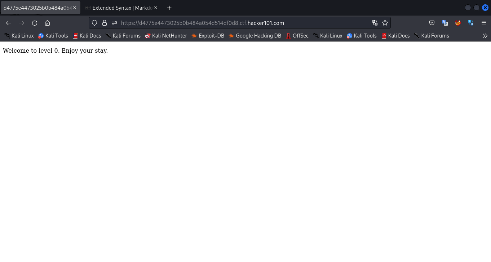
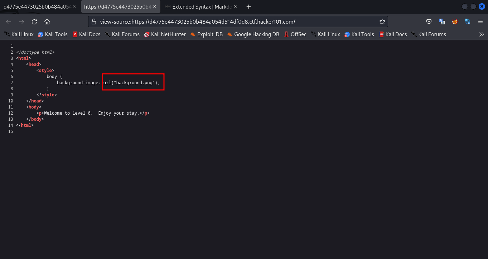
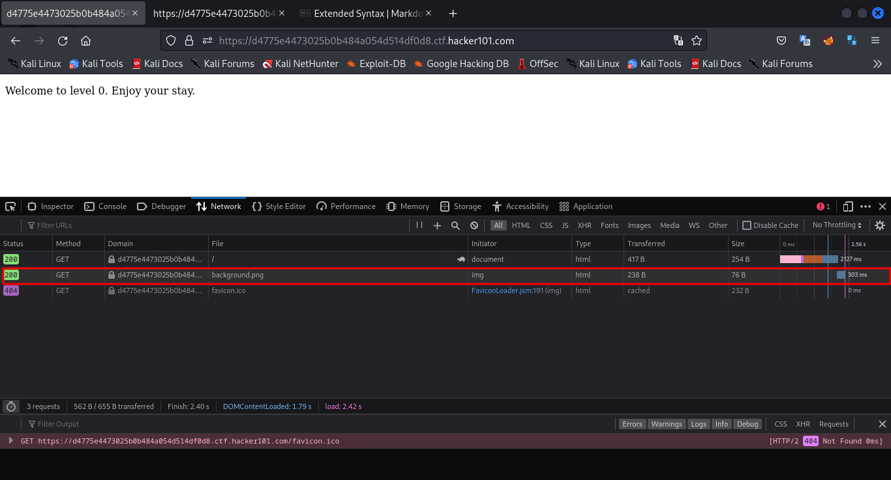
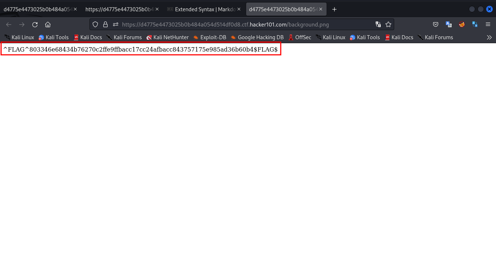

# A little something to get you started

With this challenge a link was provided (same applies to all the challenges). The link redirects to a website

It seemed like there was nothing interesting going on here. I checked the source code for the webpage

and I found nothing interesting. But the style tag contained a link to an image which was supposed to show on the page but for some reasons it didn't.

I tried to access that image using the network resource tool in the browser developer tools

if there's nothing there when you launch the network tool, refresh the page while the tool tab is open. You should see exactly what the image above is showing.

Right click on the image in the network tab and select open in new tab. It will open a new tab with the flag

`Flag: ^FLAG^803346e68434b76270c2ffe9ffbacc17cc24afbacc843757175e985ad36b60b4$FLAG$`
