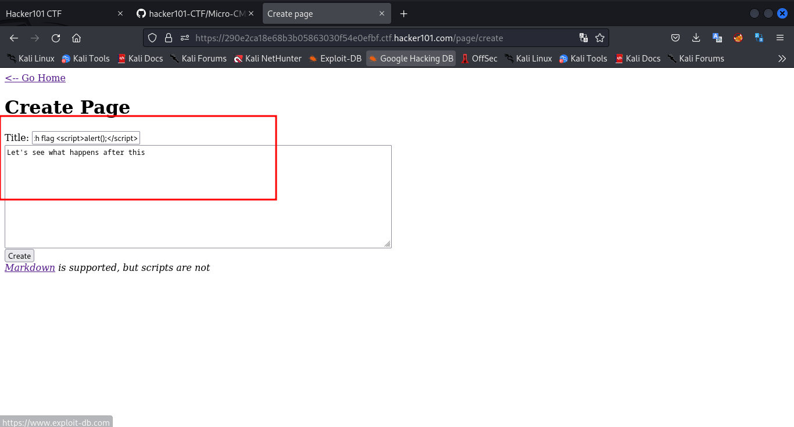
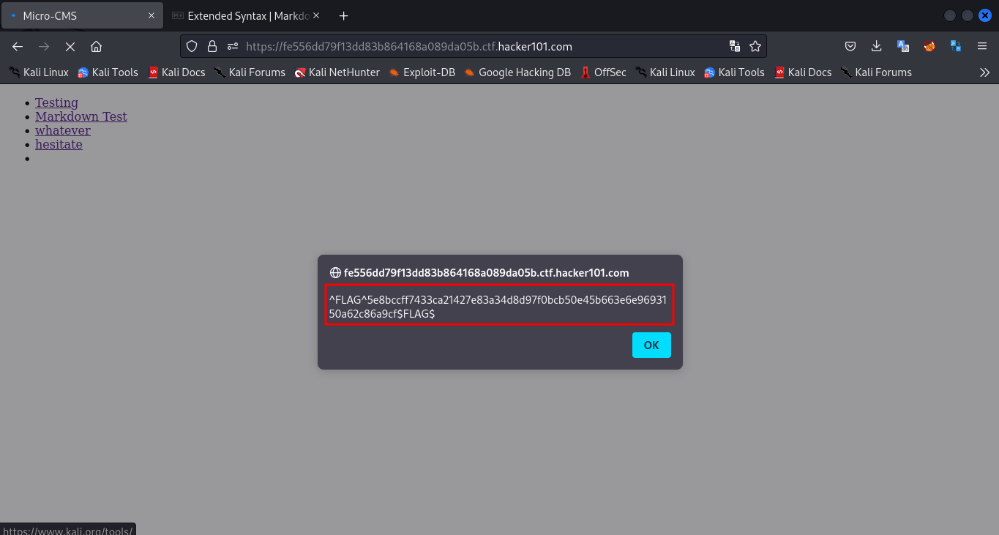
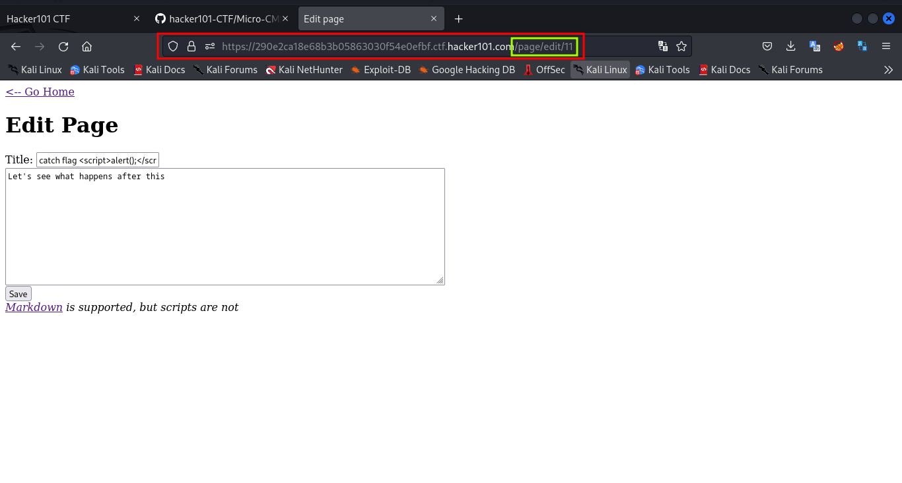
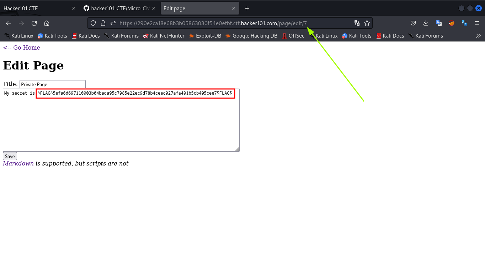
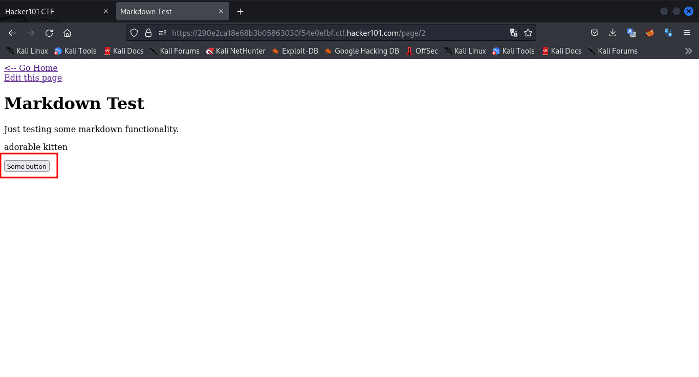
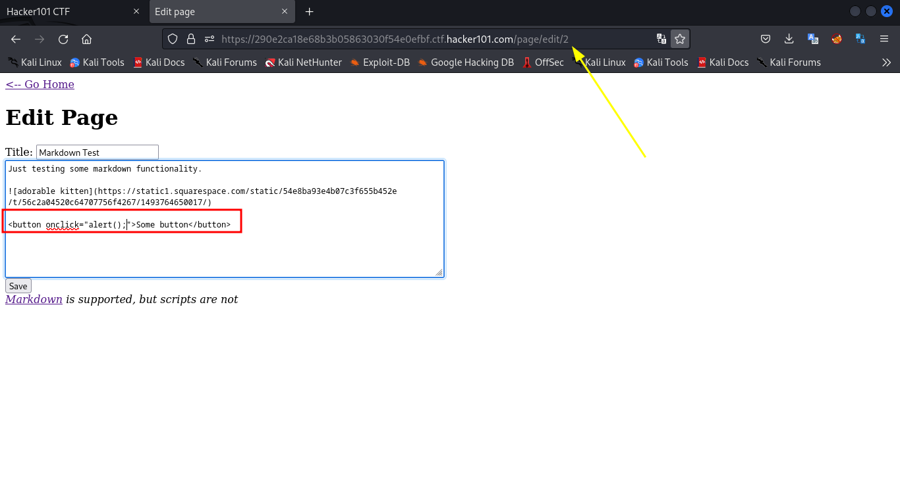
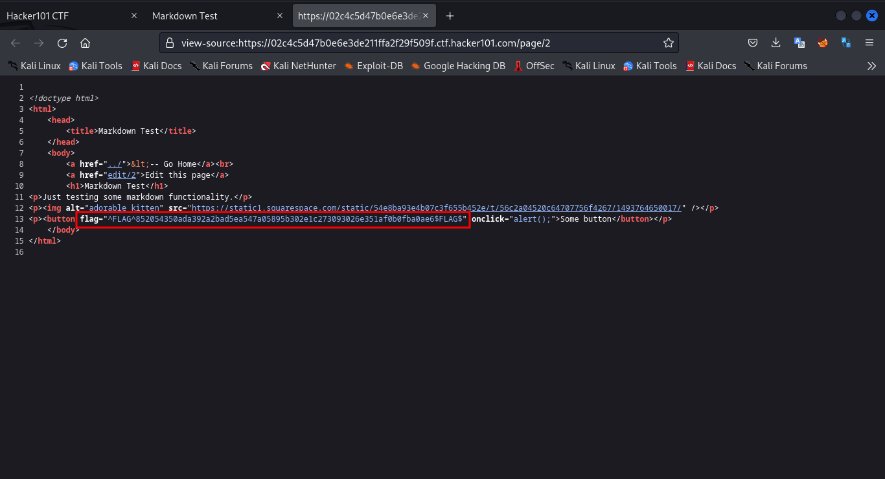
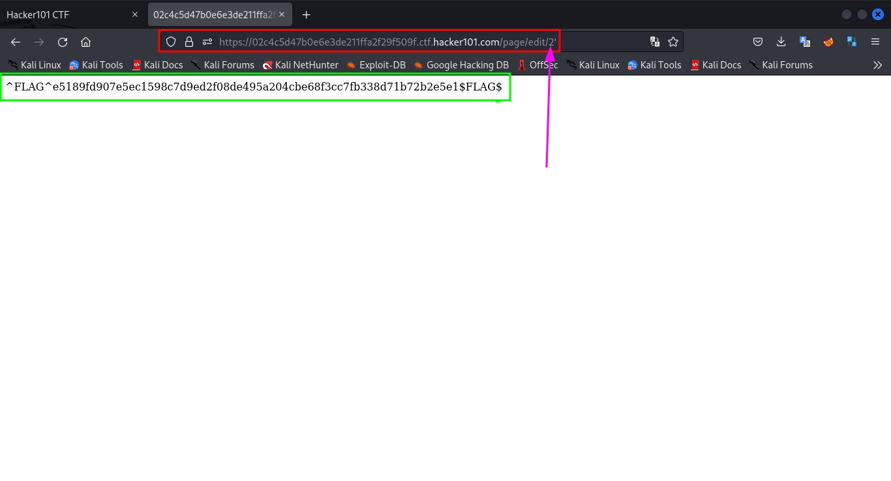

# Micro-CMS v1

I first checked the source code to find anything fishy. The source code had no juicy content. A least not any that I could notice at the moment

I then proceeded to create a page see how that works. I created a few pages and then tried some cross site scripting.

I tried cross site scripting first in the second input area (I think thats the content of the page when it's created) and then tried the first input area (I think that comes out as the title of the page). 

--- the script i used for testing ---
```js
<script>alert();</script>
```
------------------------------------



But they didn't seem to work


until I refreshed the page and decided to go to the home page to try a different method and there it was (the flag I mean).



`Flag-0: ^FLAG^5e8bccff7433ca21427e83a34d8d97f0bcb50e45b663e6e9693150a62c86a9cf$FLAG$`

For the next flag, I tried editing the page I created and realized two things.
First, the id of the page i creates starts from 11 but the id of pages already created end at 2.
Secondly, each page that is being edited has a url that looks like this 
https://hostname/page/edit/11 which means the id of is the last parameter in the url, hence enumeration could be possible



I tried enumerating manually from 3 through to 11. On the 7th id, the flag was exposed.



`Flag-1; ^FLAG^5efa6d697110003b04bada95c7985e22ec9d78b4ceec027afa401b5cb405cee7$FLAG$`

The next flag:
Before I started enumerating, I checked the already created pages and found this page which seemed on unusual. it had a button but it was not working.



So I thought of tinkering with it, when I was done enumerating. So I went to it's edit page using the enumeration method (replacing the main url with `/page/edit/2`)
On the edit page (remembering that the previous cross site scripting technique didn't work), I tried a different method (thats what I meant by tinkering with the button element).

I tried to give it some event attributes to see if that would work. The first event I tried is the onclick event.

```js
onclick="alert();"
```



After adding the onclick event to the button, I save the page and tried clicking the button. The event worked fine but the flag didn't show pop like the first one. I decided to view the source of the page again.

I found the flag of the as an attribute to the button



`Flag-2: ^FLAG^852054350ada392a2bad5ea547a05895b302e1c273093026e351af0b0fba0ae6$FLAG$
`
And the last flag:
I tried various modes of attack but proved futile. I then tried a simple sql injection in the various input fields and in the url as well. For form seemed sanitized when it came to sql injections but the url was not so I got the flag



Flag-3: `^FLAG^e5189fd907e5ec1598c7d9ed2f08de495a204cbe68f3cc7fb338d71b72b2e5e1$FLAG$`