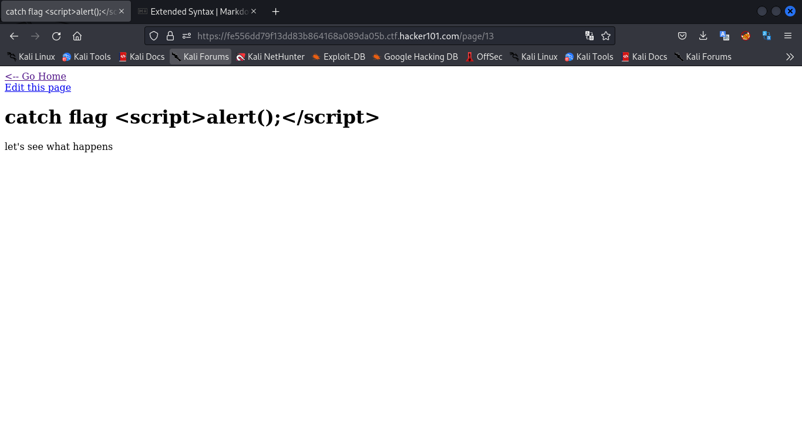

# Micro-CMS v1

I first checked the source code to find anything fishy. The source code had no juicy content. A least not any that I could notice at the moment

I then proceeded to create a page see how that works. I created a few pages and then tried some cross site scripting.

I tried cross site scripting first in the second input area (I think thats the content of the page when it's created) and then tried the first input area (I think that comes out as the title of the page). 

--- the script i used for testing ---
```js
<script>alert();</script>
```
------------------------------------


But they didn't seem to work



until I refreshed the page and decided to go to the home page to try a different method and there it was (the flag I mean).


Flag-0: ^FLAG^5e8bccff7433ca21427e83a34d8d97f0bcb50e45b663e6e9693150a62c86a9cf$FLAG$

For the next flag, I tried editing the page I created and realized two things.
First, the id of the page i creates starts from 11 but the id of pages already created end at 2.
Secondly, each page that is being edited has a url that looks like this 
https://hostname/page/edit/11 which means the id of is the last parameter in the url, hence enumeration could be possible


I tried enumerating manually from 3 through to 11. On the 7th id, the flag was exposed.


